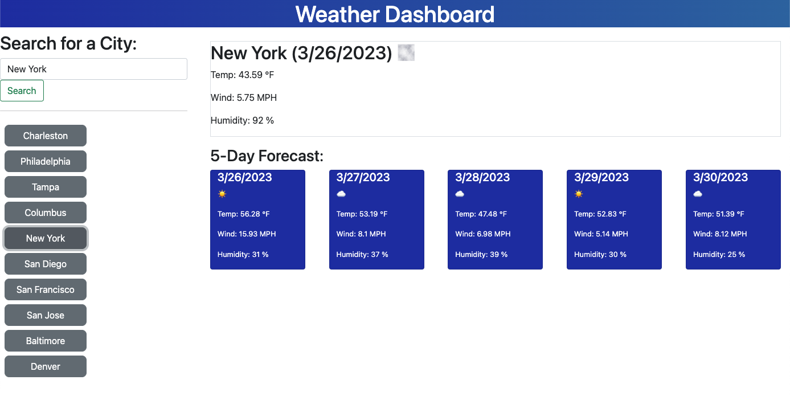

# weather-dashboard

## Description

The purpose of this project is to create a Weather Dashboard that allows a user to search different cities and see Current Weather, and a 5 Day Forecast. Searches are saved and display as buttons in the dashboard. When the buttons are clicked, the weather for that city will be displayed. 

## Link to Deployed Application
https://pan-ev.github.io/weather-dashboard/   
https://github.com/pan-ev/weather-dashboard

## Screenshot

